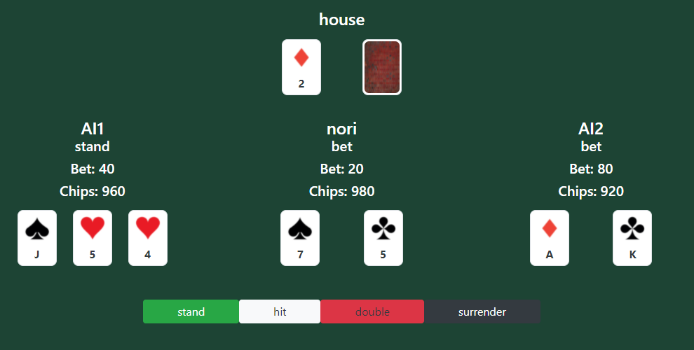

# BlackJack_Poker

## URL
https://nori-ut3g.github.io/BlackJack_Poker/

## 概要

BlackJackとPokerです。
Recursionの課題の一環で作成しました。
コードはすべてオリジナルです。
課題では、BlackJackの実装が課題ですが、個人的にPokerも実装したかったので作成しました。
（作成日時：2020年10月）

## 特徴
BlackJackではNPCはランダムにカードを交換します。

PokerではNPCが適切なカードが交換できるように工夫しました。

### Pokerのカード交換アルゴリズム
モンテカルロ法のように、役の強さと役がそろう確率を考慮して、適切なカードが交換されるように工夫しました。
具体的には、NPCのカード交換前に、別セットのカードからランダムでカードを複数回引き、役のそれぞれの確立の逆数を役の点数とし、その点数が一番多くなるカードを交換するようにしました。

